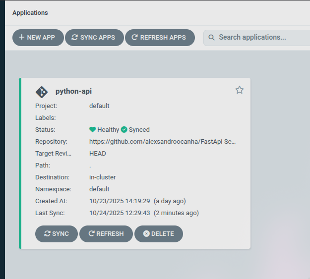
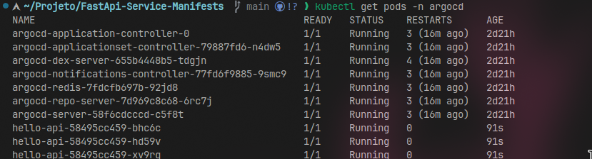
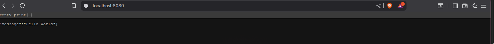
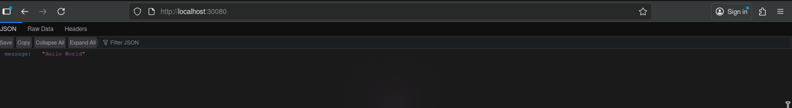
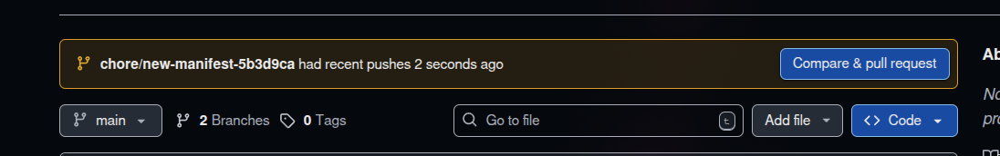
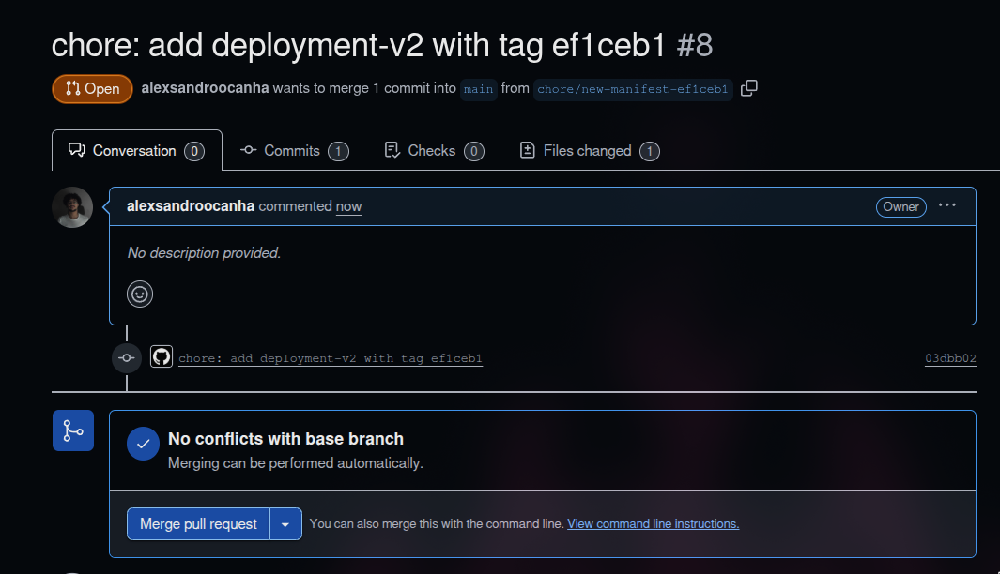
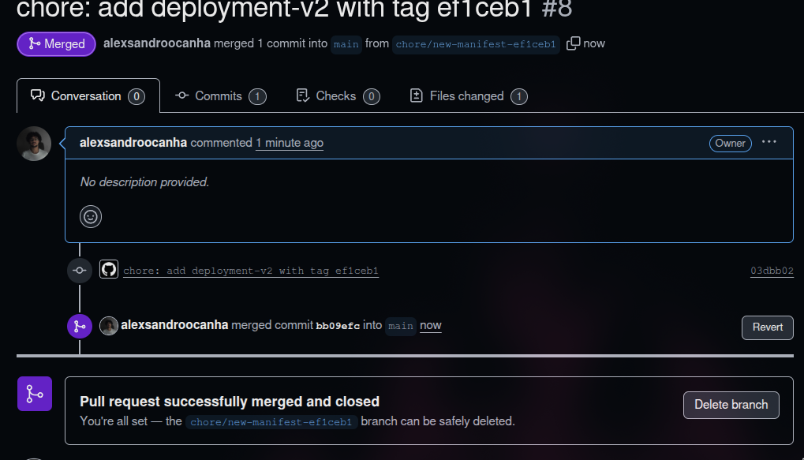

<h1 align="center">FastApi Service Manifest</h1>
<p align="center"> <i>Repositorio de armazenamento de Manifesto ArgoCD</i></p>

## Resumo
Este é o segundo repositório do **projeto (FastApi Service)**.
O CI/CD do repositório da aplicação abre um PR aqui atualizando a **tag da imagem** no `deployment-v1.yaml`. Após o merge, o `Argo CD` detecta a mudança e **sincroniza automaticamente** no cluster Kubernetes.

### Requisitos
* Cluster Kubernetes (Rancher Desktop, Minikube, Kind, etc)
* Kubernetes (kubectl)
* ArgoCD instalado dentro do cluster 
* ArgoCD CLI instalado

### Topicos
* [Visão Geral](#)

## Links Rapidos
- Repo da Alicação: https://github.com/alexsandroocanha/FastApi-Service
- Manifesto Kubernetes: `deployment-v1.yaml`
- Manifesto ArgoCD: `ArgoCD/argocd.yml`
- Documentação do `kubectl`: https://kubernetes.io/docs/tasks/tools/
- Documentação do `ArgoCD`: https://argo-cd.readthedocs.io/en/stable/operator-manual/installation/

## Visão geral
> Este repositório contém os **manifests** usados no deploy do serviço FastAPI via **Argo CD**. O pipeline do repositório da aplicação atualiza a **tag da imagem** neste repositório; após o merge, o Argo CD executa o **Sync** e aplica as mudanças no cluster.

## Estrutura do repositorio
Este projeto é dividido em 2 repositórios:
1. **Aplicação & CI/CD**
     * Contém o código da API (FastAPI), Dockerfile e o workflow do GitHub Actions para buildar e publicar a imagem no Docker Hub (ou outro registry).

>```
>├─ .github/workflows/deploy.yml
>├─ main.py
>├─ requeriments.txt
>└─ Dockerfile
>```


2. **Manifestos Kubernetes & ArgoCD (este repo)**
    * Contém os manifests K8s (Deployment/Service/etc.) e o Application do ArgoCD que consome a imagem publicada e faz o deploy/sync no cluster.

> ```
> ├─ ArgoCD/
> │  └─ argocd.yml
> ├─ k8s/
> │  └─ base-k8s.yml
> ├─ deployment-v1.yaml
> └─ README.md
> ```


---

## Como rodar a aplicação
Primeiro você precisara clonar este repositorio.
```
git clone https://github.com/alexsandroocanha/FastApi-Service-Manifests
```
Após isso você precisará criar um novo repositorio na sua conta `Github`, após criar você tera que modificar o origin do github do `repositorio clonado`.
```
git remote set-url origin <novo_url_do_repo>
```

## Instalação do ArgoCD

### Instalando o ArgoCD no Cluster 
Para verificar se o cluster esta online, abra o terminal e execute este comando

```powershell
kubectl get all
```

O proximo passo agora é criar um `Namespace` para o `ArgoCD`
```powershell
kubectl create namespace argocd --save-config
```

Agora é aonde realmente baixamos e instalamos o `ArgoCD`
```powershell
kubectl apply -n argocd -f https://raw.githubusercontent.com/argoproj/argo-cd/stable/manifests/install.yaml
```

Agora vamos verificar se os pods foram criados corretamentes
```powershell
kubectl get pods -n argocd
```

A saida deve ser algo parecido com isto
```poweshell
NAME                                                READY   STATUS    RESTARTS   AGE
argocd-application-controller-0                     1/1     Running   0          115s
argocd-applicationset-controller-5f67f4c987-vdtpr   1/1     Running   0          117s
argocd-dex-server-5859d89dcc-c69fx                  1/1     Running   0          117s
argocd-notifications-controller-75c986587-7jznn     1/1     Running   0          116s
argocd-redis-74c8c9c8c6-mzdlv                       1/1     Running   0          116s
argocd-repo-server-76f77874d7-8qscp                 1/1     Running   0          116s
argocd-server-64d5654c48-tkv65                      1/1     Running   0          116s
```

---
### Agora vamos autenticar o argoCD

Execute este comando em um `terminal`, NÃO FECHE ESTE TERMINAL, e abra outro
```
kubectl port-forward svc/argocd-server -n argocd 8080:443
```
<br>

O `ArgoCD` gera sempre uma chave aleatoria a cada instalação, para obter estas chaves no Linux você tera que executar estes 2 comandos

```powershell
# Mostra todos os arquivos secrets do namespace argocd
kubectl get secret -n argocd

# Obtem um arquivo contendo a senha criptografada em base64
kubectl get secret -n argocd argocd-initial-admin-secret -o yaml

# Você tera que descriptografar a senha de base64 para string
```

> Salve este codigo que apareceu especificamente para você em um `bloco de notas`, pois precisaremos para fazer o `Login` do `ArgoCD`.

Após isso execute o seguinte commando
```powershell
argocd login localhost:8080
```

> Concorde com os termos, e em username digite `admin` e em `password` digite aquele codigo que apareceu para você.

### Instalação da CLI do ArgoCD
Para instalar a `CLI`, basta seguir este passo a passo oferecido pela propria documentação do `ArgoCD`.

```bash
curl -sSL -o argocd-linux-amd64 https://github.com/argoproj/argo-cd/releases/latest/download/argocd-linux-amd64

sudo install -m 555 argocd-linux-amd64 /usr/local/bin/argocd
rm argocd-linux-amd64
```
[](https://argo-cd.readthedocs.io/en/stable/cli_installation/)


## Configurando o Deployment ArgoCD
Para que tudo ocorra conforme o esperado, é necessário configurar o arquivo `YAML` do `ArgoCD`.

Você precisará ajustar duas coisas: primeiro, o `repoURL`, inserindo o link do seu repositório de manifestos; e, depois, o `server`, caso esteja usando o EKS ou outros clusters em nuvem.
```yml
apiVersion: argoproj.io/v1alpha1
kind: Application
metadata:
  name: python-api
  namespace: argocd
spec:
  project: default
  source:
    repoURL: link-do-repositorio-do-manifesto
    targetRevision: HEAD
    path: .
  destination:
    server: https://kubernetes.default.svc # Este é o link do cluster
    namespace: default
  syncPolicy:
    automated: 
      enabled: true 
      prune: true
      selfHeal: true
```

>Para a realização deste projeto, é essencial publicar o manifesto do Kubernetes (gerado pelo CI/CD) em um repositório público, pois o fluxo foi pensado com esse propósito. Caso queira manter ambos os repositórios privados, consulte a documentação do ArgoCD para obter mais detalhes.
> 
>[](https://argo-cd.readthedocs.io/en/stable/)

## Aplicando o Deployment
Agora para aplicar o deployment você só precisará digitar o proximo comando
```bash
kubectl apply -f argocd.yml 
```
E pronto, sua aplicação estará online.

Para verificar se ela realmente subiu acesse a interface grafica do ArgoCD. Primeiro exponha a porta de serviço em localhost do ArgoCD.
```bash
kubectl port-forward svc/argocd-server -n argocd 8080:443 
```
E acesse no seu navegador `localhost:8080`.

Se tudo der certo, a sua aplicação ira aparecer.



Agora, é só syncronizar manualmente (Caso não queira esperar 3 minutos, o tempo padrão do auto Sync do ArgoCD)

## Testes
Para testar se a aplicação funcionou iremos realizar ?? testes.

Primeiro iremos verificar os pods, com este comando.
```bash
kubectl get pods -n argocd
``` 



Agora vamos verificar se a nossa aplicação esta online. Com isso podemos acessar por 2 maneiras. Expondo a porta da aplicação em `localhost:8080`.
```bash
kubectl port-forward deploy/hello-api -n argocd 8080:8000
```



 Ou acessando ela pelo nodeport em `localhost:30080`



## Merge / Commit e Atualização
Quando a pipeline é ativa, ele gera uma branch escrito `chore: add deployment-v2 with tag <hash do commit>`. Para fins didaticos e por segurança, alguem precisa criar o pull request para mergiar a branch com a nova imagem com a branch `main`.








### Considerações Finais
Este é o primeiro repositorio, para dar continuidade iremos para o segundo repositorio.

[](https://github.com/alexsandroocanha/FastApi-Service-Manifests)


### Informações para Contato

[](https://www.linkedin.com/in/alexsandro-ocanha-rodrigues-77149a35b/)
[](https://www.instagram.com/alexsandro.pcap/)
[](mailto:alexsandroocanha@gmail.com)